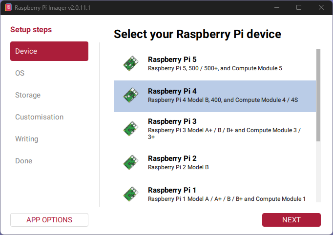
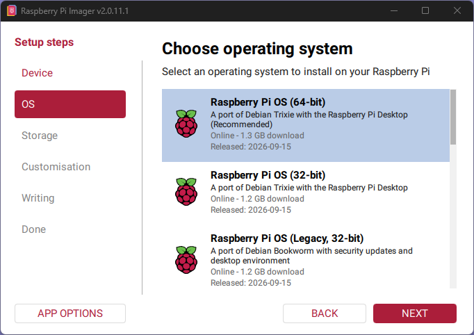
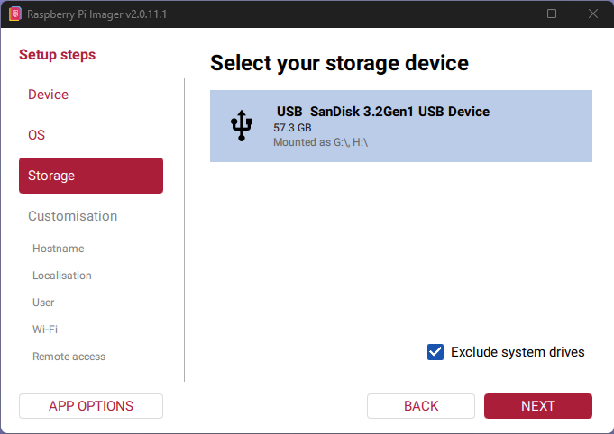
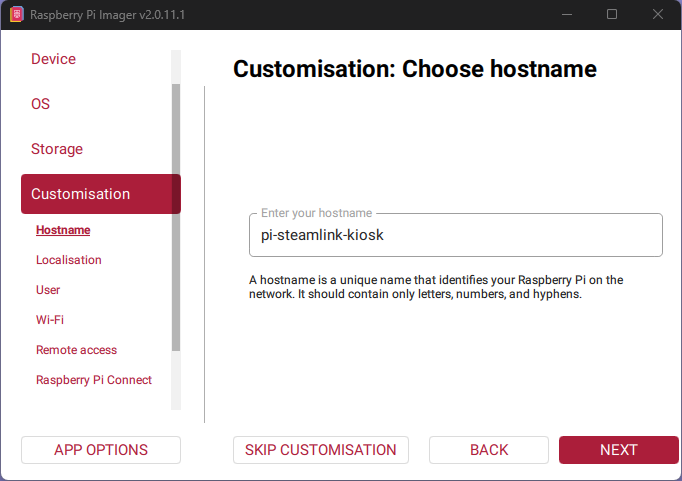
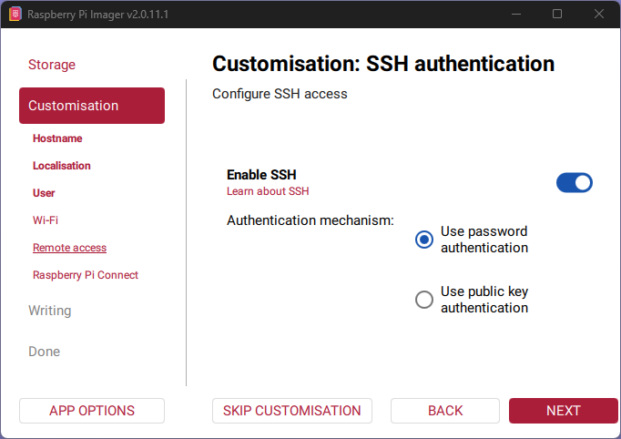
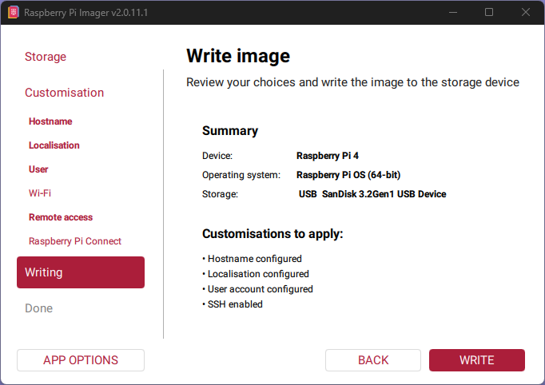

# pi-steamlink-kiosk

Turn a Raspberry Pi 4B into a dedicated **Steam Link box**: power it on and it boots straight into Steam Link. The desktop is never shown, sound plays over HDMI, and Steam Link restarts itself if it ever exits.

## Tested setup

| | |
|---|---|
| Board | Raspberry Pi 4 Model B (Rev 1.4) |
| OS | Raspberry Pi OS **Trixie** (Debian 13), 64-bit, **with desktop** |
| Kernel | 6.18.50+rpt-rpi-v8 |
| Steam Link | 1.0.16 (stable, apt repository) |
| Network | Wired Ethernet, 1080p60 over HDMI |
| Controller | Steam Controller (via the USB puck) |

Other setups (Pi 5, Bookworm, Lite images) are untested and may need changes.

## Installation guide (step by step)

No Linux knowledge needed. Follow the steps in order. Everything you type goes into a **terminal** (a window where you type commands and press Enter). Lines in grey boxes are commands: copy one, paste it, press **Enter**.

### What you need

- A **Raspberry Pi 4B** with its power supply
- A **microSD card** (16 GB or more) and a way to plug it into your PC
- A **micro-HDMI to HDMI cable** and a TV or monitor
- An **Ethernet cable** to your router (Wi-Fi works but wired is recommended for streaming)
- A **gaming PC** with Steam, on the same network
- A controller (Steam Controller or Xbox controller)
- A keyboard and mouse for the first setup (afterwards you only need them if something goes wrong)
- Raspberry Pi Imager on your PC: <https://www.raspberrypi.com/software/>

### Step 1: Put the system on the SD card

1. Plug the SD card into your PC and open **Raspberry Pi Imager**.
2. Follow the screenshots below. The important choices are **Raspberry Pi 4**, **Raspberry Pi OS (64-bit) with desktop** (not "Lite"), and **SSH enabled**.
3. Click **Write** and wait until it says it is finished. This erases the SD card.

<details open>
<summary>Raspberry Pi Imager walkthrough (screenshots)</summary>

**1. Choose your device:** Raspberry Pi 4



**2. Choose the OS:** Raspberry Pi OS (64-bit), the full version *with desktop*, not Lite



**3. Choose your SD card**



**4. Hostname:** give the Pi a name (for example `pi-steamlink-kiosk`)



**5. SSH:** enable SSH (recommended, since the kiosk has no desktop to fall back on)



**6. Summary:** check the settings, then click **Write**



The Imager layout differs slightly between versions. Remember the **username and password** you set: you need them later.
</details>

### Step 2: First boot

1. Put the SD card into the Pi. Connect HDMI to the TV, Ethernet to the router, then the power cable last.
2. Wait for the normal Raspberry Pi desktop to appear (the first boot takes a minute or two). If a setup wizard shows up, finish it.
3. Open a terminal on the Pi: click the black **Terminal** icon in the top bar.

If you set up SSH, you can instead type commands from your PC, which is more comfortable (copy and paste works). On your PC, open a terminal (on Windows: PowerShell) and run, replacing `pi-steamlink-kiosk` and `pi` with the hostname and username you chose:

```bash
ssh pi@pi-steamlink-kiosk.local
```

### Step 3: Get the files onto the Pi

Pick **one** of the two options.

**Option A (easiest): download with git.** In the Pi's terminal:

```bash
sudo apt install -y git
git clone https://github.com/nuclearn3n/pi-steamlink-kiosk.git
cd pi-steamlink-kiosk
```

**Option B: download the ZIP.** On GitHub, click the green **Code** button, then **Download ZIP**. Copy the ZIP to the Pi (for example with `scp`, a USB stick, or by downloading it in the Pi's browser). Then in the Pi's terminal, assuming the file is in your home folder:

```bash
sudo apt install -y unzip
unzip pi-steamlink-kiosk-main.zip
cd pi-steamlink-kiosk-main
```

### Step 4: Make the scripts runnable (important with Option B)

Files that were zipped, copied from Windows or downloaded in a browser often lose their "executable" flag. If you used `git clone` (Option A) this is already correct, but running the command is harmless. Always run it:

```bash
chmod +x install.sh uninstall.sh steamlink-manager.sh
```

`chmod +x` means "allow this file to be run as a program". You can check it worked with `ls -l *.sh`: each line should start with `-rwx`.

What if I see an error?

| Message | What to do |
|---|---|
| `Permission denied` | You skipped the `chmod +x` step above. Run it, then try again. |
| `bad interpreter: /bin/bash^M` | The files have Windows line endings. Run `sed -i 's/\r$//' *.sh kiosk/steamlink-kiosk*` and try again. |
| `No such file or directory` | You are in the wrong folder. Run `cd ~/pi-steamlink-kiosk` (or `cd ~/pi-steamlink-kiosk-main`) first. |

### Step 5: Run the installer

Make sure you are inside the folder (the one containing `install.sh`), then run it as your normal user. **Do not put `sudo` in front.** The script asks for your password when it needs it.

```bash
./install.sh
```

What happens:

- It updates the system and installs Steam Link. This can take several minutes.
- It asks: `Install xpadneo for Xbox controllers over Bluetooth? (y/n)`. Press `y` only if you use an Xbox controller over Bluetooth, otherwise `n`.
- It sets up the kiosk session, auto-login, and the USB polling-rate fix.
- It asks: `Reboot now? (y/n)`. Press `y`.

Want no questions at all? `./install.sh --no-xpadneo --no-reboot`, then reboot yourself with `sudo reboot`.

### Step 6: Check that it works

After the reboot, the Pi should show the boot logo and then go **straight to Steam Link**, with no desktop or taskbar. If it does, you are done with the setup.

### Step 7: Connect to your gaming PC

1. On the gaming PC, start **Steam** and sign in.
2. On the TV, Steam Link shows your PC. Select it.
3. Steam Link shows a **PIN**. Type it into Steam on the gaming PC when asked.
4. Pair your controller (Steam Controller: plug in the USB puck) and play.

Sound should come out of the TV. If not, see [docs/TROUBLESHOOTING.md](docs/TROUBLESHOOTING.md).

### Something went wrong?

- The Pi boots but you see no Steam Link, no sound, a stuck prompt, or a black screen: see [docs/TROUBLESHOOTING.md](docs/TROUBLESHOOTING.md).
- You want your normal desktop back: run `./uninstall.sh` (see [Uninstall](#uninstall)).

### Installer options

| Option | Effect |
|---|---|
| `--with-xpadneo` / `--no-xpadneo` | Install (or skip) the xpadneo Xbox Bluetooth driver without asking |
| `--no-upgrade` | Skip `apt upgrade` (still runs `apt update`) |
| `--no-reboot` | Don't offer to reboot at the end |

The installer is safe to run again.

## What it does

1. **Installs Steam Link** from the official apt repository.
2. **Optional:** installs [xpadneo](https://github.com/atar-axis/xpadneo) for Xbox controllers over Bluetooth. Note: Trixie has no `raspberrypi-kernel-headers` package. The installer uses `linux-headers-$(uname -r)`. This optional path has not been tested end to end.
3. **Adds a kiosk session** called `steamlink-kiosk`. It is a bare [labwc](https://github.com/labwc/labwc) compositor with no panel, wallpaper or file manager, running only Steam Link.
4. **Switches lightdm auto-login** to that session, so the normal desktop is never shown.
5. **Fixes HDMI audio at every boot** (see below).
6. **Sets the USB polling rate** to avoid a blocking prompt (see below).

### Why the audio fix is needed

On a stock install the default PipeWire sink can be the **3.5 mm headphone jack**, while HDMI is a separate, quieter sink. Steam Link plays to the default sink, so you get video with no sound. `raspi-config nonint do_audio` does not reliably change the default with PipeWire on Trixie.

`kiosk/steamlink-kiosk-run` waits for PipeWire (up to 30 s) at each start, finds the HDMI sink with `wpctl`, makes it the default, unmutes it and sets it to 100%. Use your TV or receiver to control the volume. If you have both HDMI ports connected, the first HDMI sink is used.

### Why the polling-rate setting is needed

If the USB mouse polling rate is above 2, Steam Link's launcher opens a terminal saying "Updating Steam Controller polling rate... Press return to continue" and **waits for Enter on every boot** (the kernel resets the value each time). Without a keyboard attached, the kiosk is stuck. `usbhid` is built into the Pi kernel, so the fix is `usbhid.mousepoll=2` on the kernel command line (`/boot/firmware/cmdline.txt`). With the rate already at 2, the prompt never appears.

## Updating Steam Link / switching to beta

```bash
./steamlink-manager.sh
```

A small menu shows the installed version and lets you update, switch to stable, or switch to the beta build. Try beta if you see dropped frames. The beta download URL comes from the original Steam Link instructions and has not been re-verified recently.

## Repository layout

```
install.sh              One-shot installer
uninstall.sh            Reverts to the normal desktop
steamlink-manager.sh    Update / stable <-> beta menu
kiosk/
  steamlink-kiosk          Session launcher (labwc only)         -> /usr/local/bin
  steamlink-kiosk-run      Audio fix + restart-on-exit loop       -> /usr/local/bin
  steamlink-kiosk.desktop  Session entry for lightdm              -> /usr/share/wayland-sessions
  rc.xml                   Minimal labwc config                   -> ~/.config/labwc-kiosk
docs/TROUBLESHOOTING.md Common problems and how to recover
```

Files changed outside this repo, with backups created on first run:

- `/etc/lightdm/lightdm.conf` (backup: `lightdm.conf.bak-steamlink`)
- `/boot/firmware/cmdline.txt` (backup: `cmdline.txt.bak-steamlink`)

## Uninstall

```bash
./uninstall.sh                      # back to the normal desktop
./uninstall.sh --remove-steamlink   # ... and remove Steam Link too
```

## Troubleshooting

See [docs/TROUBLESHOOTING.md](docs/TROUBLESHOOTING.md): no sound, stuck on a terminal prompt, black screen, getting back to a desktop, and more.

## Notes and limitations

- Because Steam Link is relaunched whenever it exits, you cannot quit it from the screen. Use SSH to stop things (see troubleshooting).
- This changes the system boot configuration. Read the scripts before running them, as you should with any script from the internet.
- Not affiliated with Valve. Steam Link is Valve's software.

## License

[MIT](LICENSE)
